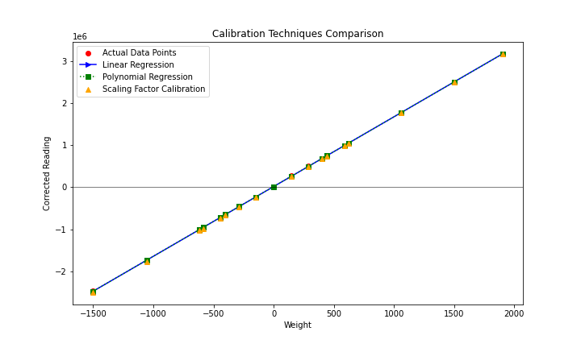

# Calibration Results for Single-Axis Load Cell

This document presents the results of applying three different calibration techniques to sensor readings obtained from a single-axis load cell.

## Calibration Techniques
- **Linear Regression**
- **Polynomial Regression**
- **Scaling Factor Calibration**

## Statistical Analysis

| Technique |  R^2 |
| --------- |  --- |
| Linear Regression | 1.0000 |
| Polynomial Regression | 1.0000 |
| Scaling Factor | 0.9998 |

## Regression Equations

- **Linear Regression Equation**: $y = 1658.9607x + 15511.4743$
- **Polynomial Regression Equation**: $y = -0.0004x^2 + 1659.1182x + 15747.2728$
- **Scaling Factor**: $1669.5857$

The analysis includes Mean Squared Error (MSE) and R^2 scores for each calibration method to help determine the most accurate approach for converting sensor readings into weight measurements.
