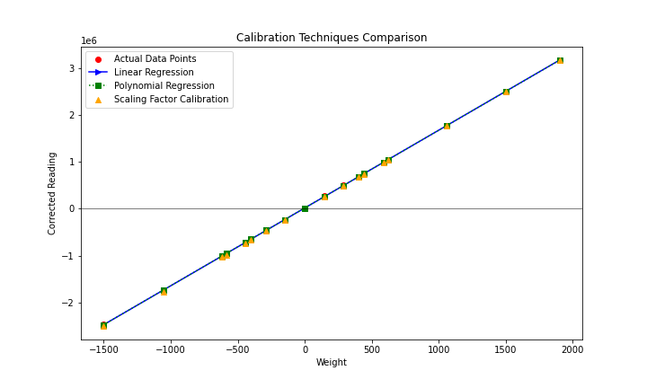

# FARE-KE: Framework for Affordable, Reliable Kinesthetic Evaluation

[](https://opensource.org/licenses/MIT)

## Overview

<p align="center">
  
</p>

<p align="center"><span style="font-size: smaller;"><em>Figure 1: Exploded isometric view of the 6- and 3-axis load cell array assembly, showing the modular sensor housing units.</em></span></p>


FARE-KE is a comprehensive, standardized framework developed to address the growing need for accessible characterization methods for kinesthetic haptic devices. Born out of the challenges faced during the COVID-19 pandemic when laboratory access was limited, this framework provides researchers with the tools and methodologies to conduct precise haptic device evaluation using affordable components and open-source technologies.

The framework emerged from research on haptic device design and was refined through applications in three distinct case studies (VR Recoil, ProxyTouch, and HapticWhirl). FARE-KE aims to democratize haptic research by making characterization methods and tools accessible to researchers of all experience levels.

## Repository Structure

```
FARE-KE
├── Board_Evaluation
│   ├── ADC_Performance            # ADC testing and benchmarking studies
│   │   ├── adc_excitation_voltage_analysis  # Comparison of voltage stability
│   │   ├── adc_noise_variation_analysis     # Noise analysis at different OSR settings
│   │   └── adc_sampling_rate_analysis       # Evaluation of sampling performance
│   ├── Calibration_Methods        # Calibration methodologies for different load cells
│   │   ├── six_axis_calibration            # Matrix-based calibration approaches
│   │   └── three_axis_calibration          # Calibration for 3-axis sensors
│   └── Load_Cell_Comparison       # Comparative studies of load cell performance
│       ├── beam_load_cell_calibration      # Linear vs polynomial calibration
│       ├── beam_load_cell_comparison       # Temperature and drift analysis
│       └── hx711_vs_mcp3564_comparison     # Comparison of ADC performance
├── Haptic_Device_Testing
│   ├── Ramp_Response              # Implementation of ramp response analysis
│   │   ├── rampResponseAnalysis.py        # Analysis script for ramp data
│   │   └── rampResponseTelemetry.cpp      # Arduino code for ramp testing
│   └── Step_Response              # Implementation of step response analysis
│       ├── StepResponseAnalysis.py        # Analysis script for step data
│       └── stepResponseTelemetry.cpp      # Arduino code for step testing
├── MCP356x_Arduino_Library        # Core software components of FARE-KE
│   ├── lib/mcp356x                # Library for MCP356x ADCs
│   │   ├── examples               # Example implementations
│   │   │   ├── Basic              # Fundamental operations (reading, sampling)
│   │   │   ├── Calibration        # Calibration examples for different scenarios
│   │   │   ├── Comparison         # Comparison with other ADC technologies
│   │   │   ├── Filtering          # Signal filtering implementations
│   │   │   ├── LoadCells          # Multi-axis load cell configurations
│   │   │   └── Telemetry          # Data visualization and transmission
│   │   └── src                    # Core library source files
│   │       ├── MCP356x.cpp/h              # Base ADC interface
│   │       ├── MCP356x3axis.cpp/h         # 3-axis load cell support
│   │       ├── MCP356x6axis.cpp/h         # 6-axis force/torque plate
│   │       └── MCP356xScale.cpp/h         # Multi-load cell management
│   └── src                        # Main application code
├── MCP356x_DAQ_PCB_Board          # Hardware design for data acquisition
│   └── ffpcbBoard                 # Custom PCB for 12-channel data acquisition
│       ├── manufacturingPCB               # Gerber files for fabrication
│       └── PCB design files               # Schematics and BOM information
└── STL files and 3D models        # Physical components for framework implementation
    ├── 3-axis load cell STLs             # 3D printable parts for custom 3-axis sensors
    ├── 6-axis force plate STLs           # Components for force/torque plate assembly
    └── testbed designs                   # Mounting systems for various device types
```

## The FARE-KE Framework Architecture

FARE-KE consists of four integrated components to provide comprehensive haptic device characterization:

### 1. Hardware Framework

<p align="center">
  
</p>

<p align="center"><span style="font-size: smaller;"><em>Figure 2: Complete 6-axis force/torque plate with ADC board and wiring, showing the integrated system.</em></span></p>

**Key Components:**
- **Load Cells**: Single-axis beam load cells, custom 3-axis, and 6-axis configurations
- **Data Acquisition System**: Custom PCB design integrating 3 x MCP3564 ADCs for 12-channel capture
- **Testbeds**: Modular aluminum designs for mounting kinesthetic devices and sensors

**Testbed Designs:**
The framework recommends using extruded aluminum (40×40mm) for testbed construction due to:
- Standardization and wide availability
- Excellent structural rigidity (minimal vibrations)
- Abundant accessories for mounting and adaptation
- Easy reconfiguration for different device sizes

The testbeds must be designed to emulate the device's operational context and accommodate the same quantity and configuration of actuators as the final prototype to ensure representative data capture.

The framework supports five types of kinesthetic feedback modalities:

1. **Direct Single-Axis Force**: For devices applying linear force directly to the user
2. **Single-Axis Impact**: For devices generating sudden bursts of energy
3. **In-line Forces**: For cable-driven exoskeletons and similar devices
4. **Rotational Joint Torque**: For devices generating torque around a pivot point
5. **Multi-axis Force/Torque**: For complex haptic controllers with multiple degrees of freedom

### 2. Data Acquisition Framework

**Components:**
- **MCP3564 ADCs**: 24-bit sigma-delta converters supporting up to 153.6 kSPS sampling
- **Op-amp Based Amplification**: Customizable gain to optimize ADC range utilization
- **Teensy 4.0 Integration**: High-speed processing of multiple ADC channels

<p align="center">
  
</p>

<p align="center"><span style="font-size: smaller;"><em>Figure 4: Detailed assembly of the custom 12-channel Data Acquisition PCB, showing component layout and interconnections.</em></span></p>

<p align="center">
  
</p>

<p align="center"><span style="font-size: smaller;"><em>Figure 5: PCB board design schematic, illustrating the intricate routing and component placement for the 12-channel ADC system.</em></span></p>

**Key Features:**
- **Sampling Rate**: Up to 10 kSPS on a single channel with internal clock
- **Resolution**: Effective resolution of 16+ bits due to signal conditioning and oversampling
- **Channels**: Support for 12 simultaneous channels when using three ADCs

**Excitation Voltage Comparison:**
| Parameter          | HX711 ADC (V) | MCP3564 ADC (V) |
|--------------------|---------------|-----------------|
| Mean voltage       | 4.2913        | 3.2840          |
| Standard deviation | 0.0140        | 0.0133          |
| Range (Max - Min)  | 0.3119        | 0.2533          |

Both ADC circuits exhibit similar interference levels in the frequency domain. The MCP3564 showed a slightly smaller standard deviation.

### 3. Calibration Framework

**Calibration Approaches:**
- **Single-Axis Calibration**: Polynomial regression providing up to 0.9999 R² fit
- **3-Axis Calibration**: Multi-point calibration with matrix-based crosstalk compensation
- **6-Axis Calibration**: Least-squares optimization for complex force/torque interactions

<p align="center">
 
</p>

<p align="center"><span style="font-size: smaller;"><em>Figure 6: Comparative analysis of different calibration techniques for beam load cells, demonstrating the linearity and accuracy of polynomial regression, linear regression, and scaling factor methods.</em></span></p>

**Calibration Mathematics:**

For single-axis load cells, three calibration approaches are evaluated:
1. **Scaling Factor**: `y = Kx` where K is a constant factor
2. **Linear Regression**: `y = mx + b` where m is slope and b is intercept
3. **Polynomial Regression**: `y = ax² + bx + c` for nonlinear behavior

For 3-axis load cells, the calibration matrix (K) accounts for both sensitivity and crosstalk:
```
[Fx]   [K11 K12 K13] [Rx]
[Fy] = [K21 K22 K23] [Ry]
[Fz]   [K31 K32 K33] [Rz]
```
Where Fx, Fy, Fz are forces, and Rx, Ry, Rz are sensor readings.

For the 6-axis force/torque plate, the 12 individual load cell readings are combined to calculate forces and torques:
```
Fx = LCAxf + LCBxf + LCCxf + LCDxf
Fy = LCAyf + LCByf + LCCyf + LCDyf
Fz = LCAzf + LCBzf + LCCzf + LCDzf
Mx = (plateLength/2) * (LCAzf + LCBzf - LCCzf - LCDzf)
My = (plateWidth/2) * (-LCAzf + LCBzf + LCCzf - LCDzf)
Mz = (plateWidth/2) * (LCAyf - LCByf + LCCyf - LCDyf) + 
     (plateLength/2) * (LCAxf + LCBxf - LCCxf - LCDxf)
```
Where LC[A-D][x-z]f represents force readings from each load cell in each direction.

### 4. Analysis Framework

**Performance Metrics:**
- **Physical Properties**: 7 metrics describing basic device characteristics
- **Ramp Analysis**: 7 metrics capturing force capabilities and static behavior
- **Step Response Analysis**: 5 metrics describing dynamic performance

## Hardware Components

### Data Acquisition System

The core of the FARE-KE framework is a custom 12-channel DAQ board built around the MCP3564 24-bit ADC:

- **Channels:** 12 differential input channels (3 MCP3564 ADCs × 4 channels each)
- **Resolution:** 24-bit per channel
- **Sampling Rate:** Up to 11.59 kSPS per channel with OSR=32
- **Multiple Configurations:** Adjustable oversampling ratio (OSR) to balance between noise rejection and sampling speed
- **Amplification:** Integrated amplification stage with MCP6V97 op-amps
- **Power Supply:** 5-12V input with separate analog and digital power domains
- **Power Consumption:** ~76.4mA with all 12 channels active


The PCB design files are available in the `MCP356x_DAQ_PCB_Board/ffpcbBoard/manufacturingPCB/` directory.

### Load Cell Configurations

#### 1. Single-Axis Beam Load Cells

The framework has validated the performance of three models:

- **TAL220:** 10kg capacity, demonstrated excellent linearity (R² > 0.999)
- **Degraw:** 5kg capacity, good performance with slightly higher noise
- **CZL635:** 5kg capacity, good performance with lower noise

| Load Cell | Capacity (kg) | Slope (counts/gf) | R² Value | Sensitivity (mgf) | Peak-to-peak noise (gf) |
|-----------|---------------|-------------------|----------|-------------------|--------------------------|
| TAL220    | 10            | 1787.65           | 0.99998  | 0.56              | 17.105                   |
| Degraw    | 5             | 2517.44           | 0.99995  | 0.40              | 10.152                   |
| CZL635    | 5             | 3033.73           | 0.99997  | 0.33              | 9.784                    |

**Temperature Drift Analysis:**
All three load cells showed sensitivity to temperature fluctuations, but with different characteristics:
- **TAL220:** Strong positive linear correlation with temperature (Pearson: 0.93, Spearman: 0.97)
- **Degraw:** Strong negative linear correlation (Pearson: -0.78, Spearman: -0.93)
- **CZL635:** Moderate positive correlation (Pearson: 0.54) but weaker monotonic relationship (Spearman: 0.12)

The maximum observed deviation was approximately 10gf over a 24-hour period (0.435% of the reading).

#### 2. Button & S-Type Load Cells

For specific applications requiring in-line force measurement:

| Load Cell Model         | Max capacity | Cost  | Type                  | Dimensions (mm)   |
|-------------------------|--------------|-------|-----------------------|-------------------|
| Honeywell FSS015WNSB    | 1.5kg        | ~70€  | Compression Load Cell | 9.14x3.18x5.59    |
| Phidget Button Load Cell| 50kg         | ~45€  | Compression Load Cell | 9mm height 25mm ⌀ |
| Phidget Button Load Cell| 200kg        | ~45€  | Compression Load Cell | 9mm height 25mm ⌀ |
| DYLY-106 (S-type)       | 10kg         | ~50€  | S-Type Load Cell      | 25x30x12mm        |

These offer advantages for inline force measurements but typically cost more due to complex manufacturing.

#### 3. 3-Axis Load Cell

Custom-designed assemblies using three single-axis beam load cells arranged orthogonally:

- 3D-printed components ensure proper alignment
- Calibration matrices compensate for crosstalk between axes
- Validated using polynomial regression calibration methods

<p align="center">
  
</p>

<p align="center"><span style="font-size: smaller;"><em>Figure 3: Side view of a 3-axis load cell mounted on the force/torque plate, showing mounting method.</em></span></p>

| Calibration Method | MAE (g) | RMSE (g) | Max Error (g) |
|--------------------|---------|----------|---------------|
| Single-Point       | 8.91    | 15.24    | 70.43         |
| Least Squares      | 8.70    | 14.72    | 67.29         |
| Polynomial Regression | 7.54 | 11.28    | 44.93         |

**Assembly Process:**
1. Apply aluminum epoxy to the load cell holders
2. Mount load cells using 3D-printed parts (base, elbows, center piece)
3. Mark and drill 2.5mm holes through the load cells
4. Tap the holes to create 3mm threads
5. Secure joints using M3 screws

#### 4. 6-Axis Force/Torque Plate

Comprehensive solution for measuring forces and torques in all directions:

- Four 3-axis load cells arranged between two acrylic plates (12mm thick)
- 12 total channels measuring force components
- Mathematical algorithms combine readings to calculate 3 forces and 3 torques
- Multipoint calibration procedures compensate for crosstalk and nonlinear behavior

| Metric    | Raw Readings | Calibrated |
|-----------|--------------|-------------|
| MAPE (%)  | 2.814737     | 1.849263    |
| R-squared | 0.983804     | 0.999691    |

**Crosstalk Reduction:**
The calibration matrix substantially reduced crosstalk, particularly along the torque axes:

| Axis | Pre-calibration Std Dev | Post-calibration Std Dev | Improvement Factor |
|------|------------------------|--------------------------|-------------------|
| Fx   | 0.1139                 | 0.0224                   | ~5x               |
| Fy   | 0.0821                 | 0.0377                   | ~2x               |
| Fz   | 0.3907                 | 0.0343                   | ~11x              |
| Mx   | 0.0846                 | 0.0154                   | ~5.5x             |
| My   | 0.0979                 | 0.0085                   | ~11.5x            |
| Mz   | 0.0528                 | 0.0043                   | ~12x              |

### Microcontroller

The framework is designed to work with Teensy 4.0 microcontrollers:

- 600 MHz ARM Cortex-M7 processor
- Support for high-speed SPI communication (up to 20 MHz)
- USB connectivity for data logging and visualization
- Sufficient I/O pins for multiple ADC control

## Software Components

### Core Library Structure

The `MCP356x_Arduino_Library` implements a hierarchical class structure:

- **MCP356x:** Base class for interfacing with the MCP3564 ADC
- **MCP356xScale:** Mid-level class for managing single-axis load cells
- **MCP356x3axis:** Class for 3-axis load cell measurement and calibration
- **MCP356x6axis:** High-level class for the complete force/torque plate

### Calibration Utilities

Located in `Board_Evaluation/Calibration_Methods/`, these tools provide:

- Single-axis load cell calibration using polynomial regression
- 3-axis load cell calibration with crosstalk compensation
- 6-axis force/torque plate multipoint calibration
- Validation scripts to verify calibration accuracy

### Analysis Scripts

The `Haptic_Device_Testing/` directory contains scripts for standardized performance evaluation:

- **Ramp Response Analysis:** `rampResponseTelemetry.cpp` and `rampResponseAnalysis.py`
- **Step Response Analysis:** `stepResponseTelemetry.cpp` and `StepResponseAnalysis.py`

### Data Logging Tools

Two primary tools are supported for data acquisition and visualization:

**TyCommander:**
- Standalone utility designed for communication with Teensy microcontrollers
- Real-time data monitoring and message printing via serial communication
- Ability to save received data as CSV files
- Reliable performance at high baud rates (unlike Arduino Serial Monitor or PuTTY)

**Telemetry Viewer:**
- Advanced data visualization and logging capabilities
- Customizable telemetry panels to monitor data streams from diverse sources
- Support for multiple serial ports and Wi-Fi
- Real-time data visualization with customizable layouts
- Data export to CSV format for further analysis

## Getting Started

### Hardware Setup

1. **Assemble the Data Acquisition Board:**
   - Manufacture the PCB using files in `MCP356x_DAQ_PCB_Board/ffpcbBoard/manufacturingPCB/`
   - Assemble components according to the BOM

2. **Prepare Load Cells:**
   - For single-axis measurements, connect beam load cells directly
   - For 3-axis measurements, follow the assembly guide in Appendix 18
   - For 6-axis measurements, assemble the force/torque plate following Appendix 23

3. **Connect Microcontroller:**
   - Connect Teensy 4.0 to the DAQ board using SPI pins
   - Connect to computer via USB for programming and data logging

### Software Setup

1. **Development Environment:**
   - Install VSCode and PlatformIO extension
   - Open the `MCP356x_Arduino_Library` folder in PlatformIO
   - Required dependencies included on the folder (BasicLinearAlgebra, ....)

2. **Upload Firmware:**
   - For basic testing, use examples from `MCP356x_Arduino_Library/lib/mcp356x/examples/`
   - For performance characterization, use scripts from `Haptic_Device_Testing/`

3. **Calibration:**
   - Follow the calibration procedures appropriate for your load cell configuration
   - Use Python scripts in `Board_Evaluation/Calibration_Methods/` to calculate calibration matrices

4. **Data Collection:**
   - Use TyCommander or Telemetry Viewer for real-time data visualization
   - Export data to CSV for further analysis

## Characterization Process

FARE-KE standardizes haptic device characterization through three methodologies:

### 1. Physical Properties Assessment

Document basic device characteristics:

| Variable              | Metrics             | Relevance                                                                                    |
|-----------------------|---------------------|----------------------------------------------------------------------------------------------|
| Workspace             | XYZ mm              | Determines the physical range in which the device can operate                                |
| Degrees of Freedom    | 2x rot., 1x transl. | Identifies the independent directions in which the device can move or rotate                 |
| Electrical Properties | Voltage, Power      | Defines the electrical requirements for the device to function properly                      |
| Device Dimensions     | XYZ mm              | Specifies the physical size of the device, important for compatibility with use cases        |
| Weight                | grams               | Indicates the heaviness of the device which can impact user comfort and device portability   |
| Operational Noise     | decibels            | Provides an idea of the acoustic disturbance caused by the device during operation           |
| Vibrations            | m/s²                | Measures the mechanical vibrations generated by the device, which can affect user experience |

### 2. Ramp Response Analysis

Characterizes static properties and load-dependent behavior:

| Variable                | Metrics      | Relevance                                                                                    |
|-------------------------|--------------|----------------------------------------------------------------------------------------------|
| Max Force/Torque        | Newtons      | Determines the maximum force or torque that the device can exert                             |
| Min Force/Torque        | Newtons      | Specifies the smallest detectable force or torque that the device can exert                  |
| Hysteresis              | Newtons      | Describes the lag in response exhibited by the device when subjected to changing inputs      |
| Sensitivity             | Newtons/Volt | Measures the change in force output per unit change in input signal                          |
| Output Force Resolution | Newtons      | Identifies the smallest detectable change in force output by the device                      |
| Dynamic Range           | dB           | Captures the range of force output the device can provide, from the minimum to maximum force |
| Stiffness               | Newtons/mm   | Quantifies the resistance of the device to deformation in response to an applied force       |

Hysteresis is calculated as the maximum difference between increasing and decreasing output curves:
```
Hysteresis = max(F_decreasing - F_increasing)
```

Dynamic range is calculated in decibels:
```
Dynamic Range (dB) = 20 * log10(Max_Force / Min_Force)
```

### 3. Step Response Analysis

Evaluates dynamic characteristics:

| Variable               | Metrics | Relevance                                                                                |
|------------------------|---------|------------------------------------------------------------------------------------------|
| Peak Force (overshoot) | Newtons | Records the maximum force output by the device in response to a sudden change in input   |
| Continuous Force       | Newtons | Measures the force that the device can maintain continuously over a prolonged period     |
| Rise time              | Seconds | Notes the time it takes for the device to reach the desired output from an initial state |
| Settling Time          | Seconds | Measures the time the device takes to stabilize after a change in input                  |
| Output Error           | %       | Provides an estimation of the error between the desired and actual output of the device  |

Rise time is typically measured from 10% to 90% of the continuous force output. Settling time is measured as the time until output stabilizes within 5% of the final value.


## Performance Considerations

### ADC Performance

The MCP3564 ADC performance varies based on Oversampling Ratio (OSR) settings:

| OSR Setting | Sampling kSPS | Standard Deviation | SNR (dB) | SD (gf) | 95% CI (gf) |
|-------------|---------------|--------------------|----------|---------|-------------|
| 32          | 11.59         | 4921.15            | 24.34    | 2.99    | ±5.98       |
| 64          | 5.79          | 4247.45            | 23.70    | 2.59    | ±5.17       |
| 128         | 2.90          | 3714.84            | 23.20    | 2.26    | ±4.53       |
| 256         | 1.45          | 3211.98            | 23.13    | 1.96    | ±3.91       |
| 512         | 0.72          | 2864.04            | 23.82    | 1.74    | ±3.49       |
| 1024        | 0.54          | 2707.46            | 24.29    | 1.65    | ±3.30       |
| 2048        | 0.36          | 2489.31            | 25.04    | 1.52    | ±3.03       |
| 4096        | 0.22          | 2318.21            | 25.68    | 1.41    | ±2.82       |

Increasing OSR improves signal quality (higher SNR, lower standard deviation) at the cost of reduced sampling rate. For applications requiring both high sampling rates and good signal quality, the OSR setting should be balanced according to specific requirements.

Multi-channel sampling reduces the effective sampling rate proportionally to the number of channels:

| OSR Setting | Single Channel (kSPS) | Four Channels (kSPS) |
|-------------|-----------------------|----------------------|
| 32          | 11.59                 | 2.8975               |
| 64          | 5.79                  | 1.4475               |
| 128         | 2.90                  | 0.725                |
| 256         | 1.45                  | 0.3625               |

With external 20MHz clock (potential future development), sampling rates could reach:
- 38.4 kSPS for single channel (OSR=32)
- 9.6 kSPS for four channels (OSR=128)

### Comparison with HX711

<p align="center">
 
</p>

<p align="center"><span style="font-size: smaller;"><em>Figure X: Comparative signal analysis showing the delay and response characteristics of MCP3564 and HX711 ADCs, highlighting the superior temporal resolution of the MCP3564.</em></span></p>

MCP3564 offers significant advantages over the commonly used HX711:

- **Sampling Rate**: MCP3564 samples at 11.59 kSPS vs. HX711's 80 SPS
- **Latency**: MCP3564 filtered data has 8.9ms delay vs. HX711's 42.5ms
- **Impact Capture**: MCP3564 captures transient peaks that HX711 misses

| Signal Type       | Average Lag Delay (ms) |
|-------------------|------------------------|
| MCP_no_filter     | -                      |
| mcp_filtered_data | 8.9                    |
| HX_no_filter      | 20.64                  |
| HX_with_filter    | 42.50                  |

In impact testing, the MCP3564 recorded impulses of ~0.39 Ns compared to the HX711's ~0.345-0.335 Ns, showing better accuracy in capturing transient events.

## References

For detailed information about the framework design, implementation, and validation, refer to:

- **Thesis Chapter 3:** FARE-KE Framework Overview
- **Thesis Chapter 4:** Data Acquisition Board Design
- **Thesis Chapter 5:** Sensor/Hardware Validation
- **Appendix 14:** Instrument Amplifier Comparison
- **Appendix 18:** 3-Axis Load Cell Assembly Guide
- **Appendix 20:** 3-Axis Single Point Calibration
- **Appendix 21:** 3-Axis Multipoint Calibration
- **Appendix 23:** 6-Axis Load Cell Multipoint Calibration
- **Appendix 24:** Analysis Implementations

## License

This project is released under the MIT License. See the LICENSE file for details.

## Citation

If you use FARE-KE in your research, please cite:

```
@thesis{bernamoya2025fare,
  title={FARE-KE: Framework for Affordable, Reliable Kinesthetic Evaluation},
  author={Berna Moya, Jose Luis},
  year={2025},
  school={University of Sussex}
}
```